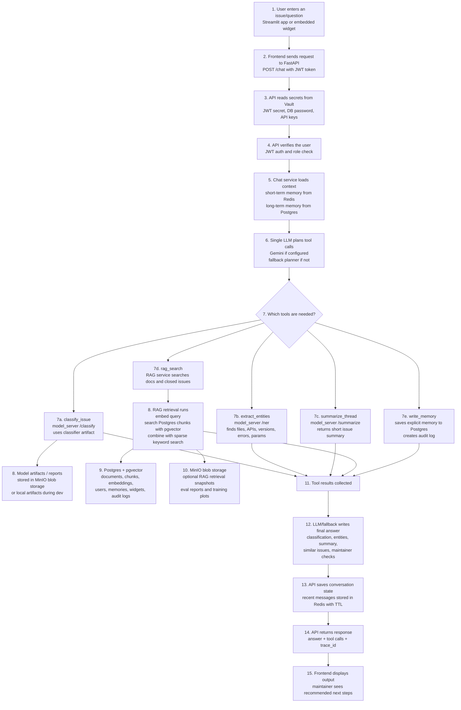

# Maintainer's Copilot App Workflow

Paste this Mermaid code into Mermaid AI or the Mermaid Live Editor.

```mermaid
flowchart TD
    A["1. User enters an issue/question<br/>Streamlit app or embedded widget"] --> B["2. Frontend sends request to FastAPI<br/>POST /chat with JWT token"]

    B --> C["3. API reads secrets from Vault<br/>JWT secret, DB password, API keys"]

    C --> D["4. API verifies the user<br/>JWT auth and role check"]

    D --> E["5. Chat service loads context<br/>short-term memory from Redis<br/>long-term memory from Postgres"]

    E --> F["6. Single LLM plans tool calls<br/>Gemini if configured<br/>fallback planner if not"]

    F --> G{"7. Which tools are needed?"}

    G --> H["7a. classify_issue<br/>model_server /classify<br/>uses classifier artifact"]
    G --> I["7b. extract_entities<br/>model_server /ner<br/>finds files, APIs, versions, errors, params"]
    G --> J["7c. summarize_thread<br/>model_server /summarize<br/>returns short issue summary"]
    G --> K["7d. rag_search<br/>RAG service searches docs and closed issues"]
    G --> L["7e. write_memory<br/>saves explicit memory to Postgres<br/>creates audit log"]

    H --> BS["8. Model artifacts / reports<br/>stored in MinIO blob storage<br/>or local artifacts during dev"]

    K --> M["8. RAG retrieval runs<br/>embed query<br/>search Postgres chunks with pgvector<br/>combine with sparse keyword search"]

    M --> PG["9. Postgres + pgvector<br/>documents, chunks, embeddings,<br/>users, memories, widgets, audit logs"]

    M --> BS2["10. MinIO blob storage<br/>optional RAG retrieval snapshots<br/>eval reports and training plots"]

    H --> N["11. Tool results collected"]
    I --> N
    J --> N
    M --> N
    L --> N

    N --> O["12. LLM/fallback writes final answer<br/>classification, entities, summary,<br/>similar issues, maintainer checks"]

    O --> P["13. API saves conversation state<br/>recent messages stored in Redis with TTL"]

    P --> Q["14. API returns response<br/>answer + tool calls + trace_id"]

    Q --> R["15. Frontend displays output<br/>maintainer sees recommended next steps"]
```
